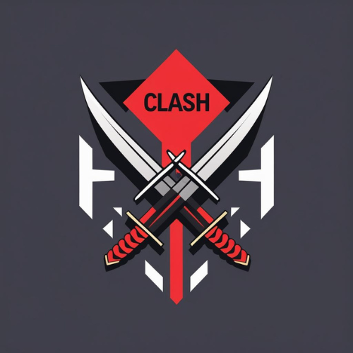

<p align="center">
  
</p>

<h1 align="center">Clash</h1>

<p align="center">
  <strong><em>Avoid merge conflicts across git worktrees for parallel AI coding agents</em></strong>
</p>

Clash is an **open-source CLI tool** that helps avoid merge conflicts across **git worktrees**.

It's designed for developers running multiple AI coding agents (*Claude Code, Codex, Cursor*, etc.) in parallel — helping them identify **potential conflicts early** in the development process so they can work around them before it's too late.

<p align="center">
  <a href="https://rust-lang.org"></a>
  <a href="LICENSE"></a>
  <a href="https://crates.io/crates/clash-sh"></a>
  <a href="https://github.com/clash-sh/clash/actions"></a>
</p>

## Table of Contents

- [Problem Statement](#problem-statement-with-some-context)
- [Clash - The Saviour](#clash---the-saviour)
- [Quick Start](#quick-start)
  - [Step 1: Install](#step-1-install)
  - [Step 2: Set Up Your AI Agent](#step-2-set-up-your-ai-agent)
  - [Step 3: Manual CLI Usage](#step-3-manual-cli-usage)
- [Core Features](#core-features)
  - [Plugin Integration](#plugin-integration-claude-code--recommended)
  - [Check Command](#check-command-manual)
  - [Status Command](#status-command)
  - [Watch Mode](#watch-mode)
  - [JSON Output](#json-output)
- [Example: Multi-Agent Workflow](#example-multi-agent-workflow)
- [How It Works](#how-it-works)
- [Use Cases](#use-cases)
- [Architecture](#architecture)
- [Contributing](#contributing)
- [FAQ](#faq)

## Problem Statement with Some Context

AI coding agents like Claude Code have transformed software development as we know it. Developers now run **3-6+ agents simultaneously**, each working on a different feature/bug fix. The recommended approach put forward by most frontier labs is to isolate each agent in its own **git worktree** — essentially a separate working directory with its own branch.

When multiple AI agents (or developers) work in separate worktrees, they're **blind to each other's changes** and inevitably touch overlapping parts of the codebase. Conflicts only surface at feature completion, often after **significant work and time is wasted**. Current tools only catch these conflicts later down the line — we can do better by detecting them *earlier* in the process.

Clash surfaces **worktree-to-worktree conflicts early**, so you and your agents can be aware of overlapping changes and act on them before it's too late.

**Real quotes from developers:**

> *"Now you have created the fun new ability to create merge conflicts with yourself."*
> — GitButler Blog

> *"I now know to expect potential conflicts. This happened to me recently, which was a big learning moment."*
> — Developer on Medium

> *"If conflicts look tricky, I throw away the work."*
> — Developer workflow description

## Clash - The Saviour

Clash detects merge conflicts **between all worktree pairs** during development, helping you/agent:
- **Guard file writes via hooks** — automatic conflict check before every AI agent edit
- **See conflicts instantly** across all active worktrees
- **Visualize conflict matrix** showing which branches conflict
- **Monitor in real-time** as files change
- **Integrate with AI agents** via Claude Code hooks, CLAUDE.md instructions, or JSON output

### Clash in Action

**[Hook integration](#hook-integration-claude-code--recommended)** — Clash automatically detects conflicts before Claude Code writes a file. A single line in your settings and every file edit is guarded — no prompts to remember, no commands to run:


*Automatic conflict detection — Clash prompts you before a conflicting edit goes through*

**CLI usage** — Ask your agent to use Clash directly for a full conflict overview:


*Clash alerts Claude Code to conflicts in another worktree, enabling smarter parallel development*

## Quick Start

### Step 1: Install

Pick whichever you prefer:

```bash
curl -fsSL https://clash.sh/install.sh | sh   # Quick install (macOS/Linux)
brew tap clash-sh/tap && brew install clash     # Homebrew
cargo install clash-sh                          # From crates.io
```

### Step 2: Set Up Your AI Agent

**Claude Code (Recommended: Plugin)**

Install the Clash plugin — it automatically checks for conflicts before every file write:

```bash
claude plugin marketplace add clash-sh/clash
claude plugin install clash@clash-sh
```

**That's it.** Clash will prompt you whenever Claude tries to edit a file that conflicts with another worktree.

<details>
<summary><strong>Alternative: Manual hook setup</strong></summary>

If you prefer not to use the plugin, add the `hooks` key to your `.claude/settings.json`:

```json
{
  "hooks": {
    "PreToolUse": [
      {
        "matcher": "Write|Edit|MultiEdit",
        "hooks": [{ "type": "command", "command": "clash check" }]
      }
    ]
  }
}
```

</details>

**Codex / Cursor / Windsurf / Other Agents (Manual)**

If hooks aren't available, add to your project instructions (e.g. `.claude/instructions.md`, `.cursorrules`):

```markdown
IMPORTANT: Before editing any file, run `clash check <file>` to check for merge conflicts
with other worktrees. If conflicts are detected, examine the conflicting files and adapt
your approach to avoid or minimize them.

Run `clash status` periodically (especially before and after commits) to get a full
conflict overview across all worktrees.

Run `clash --help` for all available commands.
```

### Step 3: Manual CLI Usage

```bash
# Check a single file for conflicts
clash check src/main.rs

# Check conflicts across all worktrees
clash status

# Output as JSON for scripts/agents
clash status --json

# Watch for conflicts in real-time
clash watch
```


## Core Features

### Plugin Integration (Claude Code) — Recommended

The best way to use Clash with Claude Code — **automatic conflict detection before every file write, zero ongoing effort.**

```bash
claude plugin marketplace add clash-sh/clash
claude plugin install clash@clash-sh
```

Or manually add the hook to your `.claude/settings.json`:

```json
{
  "hooks": {
    "PreToolUse": [
      {
        "matcher": "Write|Edit|MultiEdit",
        "hooks": [{ "type": "command", "command": "clash check" }]
      }
    ]
  }
}
```

When Claude tries to write or edit a file, Clash automatically:
1. Reads the target **file path** from the hook's stdin
2. Checks it for **conflicts across all worktrees**
3. If conflicts are found, prompts you with an **"ask" decision** — you can approve or deny the edit


*Clash detects a conflict before Claude writes the file, giving you a chance to intervene*

> **Note:** Claude Code currently doesn't display the `permissionDecisionReason` in the prompt UI ([anthropics/claude-code#24059](https://github.com/anthropics/claude-code/issues/24059)). You'll see the permission prompt but not the conflict details. As a workaround, you can run `clash check <file>` manually to see full details.

### Check Command (Manual)

You can also run `clash check` manually to check a single file for conflicts across all worktrees:

```bash
clash check src/main.rs
```

```json
{
  "file": "src/main.rs",
  "current_worktree": "main",
  "current_branch": "main",
  "conflicts": [
    {
      "worktree": "clash-agent1",
      "branch": "feature/auth",
      "has_merge_conflict": true,
      "has_active_changes": false
    }
  ]
}
```

Exit codes: `0` = *no conflicts*, `2` = *conflicts found*, `1` = *error*.

### Status Command

Shows a beautiful conflict matrix for all worktree pairs:

```
╔════════════ Conflict Matrix ════════════╗
║            │ main  feat/a  feat/b  feat/c║
╟────────────┼─────────────────────────────╢
║main        │  -     OK      OK      OK   ║
║feature/a   │  OK     -      2       1    ║
║feature/b   │  OK     2      -       3    ║
║feature/c   │  OK     1      3       -    ║
╚══════════════════════════════════════════╝
```

Numbers indicate **conflicting files**. **"OK"** means no conflicts.

### Watch Mode
Live **TUI monitoring** with automatic refresh on file changes:

```bash
# Shows worktree status and conflict updates in real-time
clash watch
```


### JSON Output

**Machine-readable output** for CI/CD and AI agents:


## Example: Multi-Agent Workflow


*Coordinating multiple AI agents across worktrees - each agent works independently while using Clash for monitoring for conflicts*

## How It Works

Clash uses `git merge-tree` (via the *gix* library) to perform **three-way merges** between worktree pairs **without modifying your repository**. It:

1. **Discovers** all worktrees (main + linked)
2. **Finds the merge base** for each pair
3. **Simulates the merge** to detect conflicts
4. **Reports** conflicting files

This is **100% read-only** — your repository is *never* modified.

## Use Cases

### For AI Agent Orchestrators
Prevent wasted compute when agents' work conflicts:
```bash
# Check before expensive operations
if clash status --json | jq -e '.conflicts | length > 0'; then
  echo "Conflicts detected! Replan agent tasks"
fi
```

### For Human Teams
See what your teammates are changing before you merge:
```bash
# Add to git pre-merge hook
clash status || echo "Warning: Conflicts detected!"
```

### For CI/CD Pipelines
Fail fast when feature branches conflict:
```yaml
- name: Check for conflicts
  run: |
    cargo install clash
    clash status --json > conflicts.json
    jq -e '.conflicts | length == 0' conflicts.json
```

## Architecture

Clash is written in **Rust** for speed and reliability:

| Crate | Purpose |
|-------|---------|
| **gix** | Git operations without shelling out |
| **ratatui** | Terminal UI framework |
| **notify** | File system watching |
| **serde** | JSON serialization |

**Single binary, no runtime dependencies.** Works anywhere git works.

## Contributing

We really appreciate **all contributions** big or small!

- ⭐ Star the repo — helps others discover Clash
- 🗣️ Tell a friend about Clash
- 📝 [**Open an issue**](https://github.com/clash-sh/clash/issues/) — feedback, feature requests, even small friction points or confusing messages, or [AI agent coordination pain not yet solved](https://github.com/clash-sh/clash/issues/new?title=Agent%20coordination%20friction%3A%20&body=%23%23%20The%20friction%0A%0A%3C!--%20What%20agent%20coordination%20task%20is%20still%20painful%3F%20--%3E%0A%0A%23%23%20Current%20workaround%0A%0A%3C!--%20How%20do%20you%20handle%20this%20today%3F%20--%3E%0A%0A%23%23%20Ideal%20solution%0A%0A%3C!--%20What%20would%20make%20this%20easier%3F%20--%3E)
- 📢 **Share**: [X](https://twitter.com/intent/tweet?text=Clash%20%E2%80%94%20Avoid%20merge%20conflicts%20across%20git%20worktrees%20for%20parallel%20AI%20coding%20agents&url=https%3A%2F%2Fgithub.com%2Fclash-sh%2Fclash) · [Reddit](https://www.reddit.com/submit?url=https%3A%2F%2Fgithub.com%2Fclash-sh%2Fclash&title=Clash%20%E2%80%94%20Avoid%20merge%20conflicts%20across%20git%20worktrees%20for%20parallel%20AI%20coding%20agents) · [LinkedIn](https://www.linkedin.com/sharing/share-offsite/?url=https%3A%2F%2Fgithub.com%2Fclash-sh%2Fclash)

See [CONTRIBUTING.md](CONTRIBUTING.md) for some more details.

## FAQ

**Q: Does Clash modify my repository?**
A: **Never.** Clash is 100% read-only. It simulates merges in memory.

**Q: Can it resolve conflicts?**
A: Not yet — Clash *detects* conflicts. Resolution suggestions may come in a future version. In the meantime, your AI agent can act on the conflict information directly.

## Support

- 🐛 [Report bugs](https://github.com/clash-sh/clash/issues)
- 📧 [Email support](mailto:matk9@clash.sh)

## License

MIT - See [LICENSE](LICENSE) file for details.

## Acknowledgments

Built with Love, Rust & Claude.

Special thanks to the Rust community for incredible libraries that made this possible.